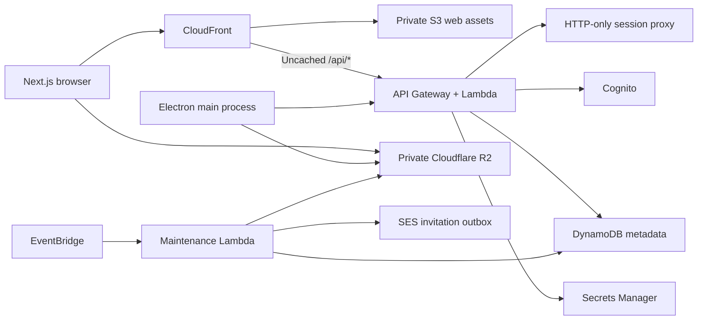

# Architecture and consistency

File bodies travel directly to/from the object store. Lambda handles metadata and authorization only.

## Metadata

One DynamoDB table uses `pk`/`sk`, optimistic `v` versions, and a `data` payload. Every mutation uses `TransactWriteItems`; transactions condition-check all records they read. Bounded retry reruns the domain transaction after contention. No domain mutations use last-writer-wins updates.

| Partition                           | Sort key / purpose                                               |
| ----------------------------------- | ---------------------------------------------------------------- |
| `USER#id`                           | `PROFILE`, account quota and monotonic sync sequence             |
| `USER#id`                           | `ITEM#id`, logical file/folder metadata                          |
| `USER#id`                           | `NAME#parent#normalized`, transactional uniqueness claim         |
| `USER#id`                           | `CHILD#parent#name#id`, active directory lookup                  |
| `USER#id`                           | `ALLCHILD#parent#id`, full hierarchy for recursive deletion      |
| `USER#id`                           | `VERSION#item#version`, immutable file versions                  |
| `USER#id`                           | `UPLOAD#id`, quota reservation and multipart state               |
| `USER#id`                           | `CHANGE#paddedSequence`, durable ordered sync feed               |
| `USER#id`                           | operation receipts, device records, shares, notifications, audit |
| `USERNAME` / `EMAIL`                | normalized identity lookup and username reservations             |
| `ITEMOWNER`                         | opaque item-to-owner routing; never authorization by itself      |
| `OBJECT`                            | immutable content key and physical reference count               |
| `PIN#object`                        | per-sender active transfer retention count                       |
| `TRANSFER` / `TRANSFER#id`          | transfer state / immutable manifest entries                      |
| `BUILD#id` / `SAVE#id` / `PURGE#id` | durable workflow state and work journal                          |
| `JOB`                               | retryable jobs; sparse `jobs` index orders due work              |

`PROFILE` mutations serialize each user’s quota/sequence changes. Structural queries also condition-check the account record so concurrent inserts cannot violate hierarchy or snapshot assumptions. Parent chains are strongly read and checked before mutation. Names are Unicode NFC and lowercase for comparison, with separators/control characters rejected.

Quota includes all retained logical versions, backups and trash. Historical versions intentionally consume capacity. Bytes in unfinished uploads and staged saves are reserved. Old versions are not silently expired.

Operation receipts last at least seven days. Upload completion also stores its own immutable completion fingerprint and result. Reusing an operation ID with a different payload is rejected.

## Upload lifecycle

1. Atomically reserve integer bytes and persist the upload session.
2. Create/attach a provider multipart session. Losing initialization attempts are aborted; the R2 lifecycle also removes orphan incomplete multipart sessions after two days.
3. Sign bounded part requests. Clients stream/chunk the file and retain receipts.
4. Persist `COMPLETING`, complete the provider object, verify `HEAD` size, then atomically create object/version/item records, convert reserved to used bytes, and append the sync event.
5. A retry after provider completion uses the existing object and persisted completion manifest. Cancellation/expiry releases quota exactly once. Delayed cleanup handles a provider-completion/cancellation race.

R2 does not expose a standard whole-file multipart SHA-256 equivalent to the supplied client hash; the ETag is not a SHA-256. Client hashes are retained as declared integrity metadata. Desktop downloads recompute the hash before replacing local files. Independent server-side full-object hashing is a remaining hardening task, not something claimed by the size check.

## Transfers and object lifetime

Small transfers use one transaction. Larger trees use a durable manifest work queue; each captured version pins its immutable object. Captures check a sender sequence watermark and fail safely if the source drive changes during preparation. Recipients do not see partial manifests.

Save-to-Drive reserves the complete recipient cost first. Large saves create hidden staged records in small transactions. One final transaction activates the stage and converts its reservation into used storage. Failures remove staged references/names and release the reservation. `TRANSFER_SAVED` prompts desktop full metadata reconciliation.

Object reuse occurs only through an explicitly authorized transfer or version restore. There is no global hash lookup or content-based cross-user deduplication. Each version and active transfer pin is counted transactionally. A zero-reference object is queued for delayed removal.

Transfers expire 30 days after creation, including accepted transfers. Saving to Drive keeps a recipient-owned logical copy beyond expiration. The sender’s version remains counted if pending permanent deletion would otherwise remove content still pinned by that sender’s transfer. After cancellation/decline/expiration releases the pin, queued deletion continues. This prevents repeatedly uploading/sending/purging to bypass storage capacity, without imposing a transfer allowance.

Shares refer to the owner’s logical item and support ancestor inheritance. Transfers refer to immutable version snapshots. Revoked shares lose API access immediately; previously issued download URLs naturally expire within five minutes.

## Authentication

Cognito verifies identities and email, owns passwords and refresh rotation, and applies its normal abuse protections. The API verifies access-token signatures/client/token-use and calls Cognito `GetUser`, then checks the token-family device record. Revoking a device blocks existing and refreshed tokens from that family, including attempts to re-register it. Signing in creates a new family.

The web session proxy stores access/refresh credentials in HTTP-only, SameSite Strict cookies, marked Secure on HTTPS. It checks Origin on mutations, proxies only `/v1` paths, and strips tokens from browser-visible authentication responses. No refresh credentials enter localStorage. The shared proxy runs inside Lambda for the CloudFront site and inside a Next.js route for local development; the deployed Lambda invokes the API handlers internally rather than making another HTTP request.

CloudFront serves the static Next.js export from a private S3 REST origin using origin access control. The web asset bucket is separate from R2, which stores user files. The `/api/*` behavior forwards cookies and request headers except the viewer Host, and disables all caching. API error statuses are preserved, without a global SPA error-page rewrite. Hashed JavaScript assets are cached immutably; HTML is revalidated. The isolated static build omits the server route and does not copy environment files.

Electron’s main process owns authentication, networking and filesystem I/O. The in-app email/password form sends credentials over validated IPC to the main process, which calls the HTTPS login API. Passwords are never persisted or sent to an external browser. `safeStorage` protects refresh credentials; insecure Linux plaintext fallback is refused. The preload API exposes only validated operations and native file/folder dialogs. The renderer has no Node.js access or direct network permission.

## Desktop recovery

SQLite WAL stores local mappings, roots, pending operations, upload IDs/receipts and the last committed change cursor. A cursor advances only after applying its complete page. Uploads check source size/mtime and restart safely if local contents change. Downloads retain a partial file for range resumption, validate final size/SHA-256, and rename only after verification.

Divergent local content is moved to a deterministic conflict filename before applying cloud content. Remote folder deletion conservatively moves the local directory into `.harbor-recovered-*`. Backup roots upload one way and never apply remote changes to their original source folders.

Native watchers are not a complete filesystem transaction log. Local renames currently become create/delete pairs, and full platform crash/sleep/wake testing remains required before distributing signed releases.

## Operations and schema evolution

Schema v1 is the table/index definition in CDK plus the keys above. Attributes are additive. Future key-layout changes must ship a versioned, resumable backfill before readers depend on them; do not silently reinterpret deployed rows. Local data created during development can be rebuilt from source files or backfilled explicitly. SQLite initializes migration version 1 and preserves its journal across restarts.

DynamoDB TTL is used for transient receipts/rate buckets/audit retention, never to release quota or delete referenced content. Those operations require application transactions. Maintenance jobs persist retries/backoff; email is at-least-once delivery and may duplicate if delivery succeeds just before the acknowledgement fails. Failures log only event type/attempt count, not private filenames or tokens.

This version uses one sparse job partition and one account sequence counter. Load-test hot-account contention, job throughput, Cognito request cost, long-running manifest behavior, and retention accounting before scaling. These are documented scaling boundaries rather than untested throughput claims.

### Folder ZIP downloads

`POST /v1/folder-downloads` creates an authenticated, idempotent archive job and wakes the maintenance Lambda asynchronously. `GET /v1/folder-downloads/:id` reports preparation state and overall bytes; `DELETE` cancels preparation. Listing pins immutable file versions before writing, preserves nested/empty directories and rejects unsafe paths. A change to the source owner's sequence during listing fails preparation rather than silently mixing listings.

Lambda writes ZIP STORE/ZIP64 records to R2 multipart storage with a 16 MiB part buffer, CRC32 per entry and SHA-256 integrity checks. DynamoDB checkpoints preserve entry offsets, hash states and completed parts; a small temporary tail object allows yielding mid-file or between many small entries without violating multipart minimum/equal-part sizes. Leases prevent concurrent workers. Scheduled invocations resume unfinished jobs; transient failures retry from the last committed checkpoint. This avoids buffering a whole ZIP, Lambda's streamed-response size ceiling and the existing HTTP API's buffered response limit.

Once ready, the app hands one short-lived signed archive URL to the browser's download manager. Preparation progress belongs to the app; transfer progress belongs to the browser. Desktop downloads the same archive through its existing verified download path. Source access is rechecked before issuing URLs. Archives expire after 24 hours; cancellation, failure and expiry release source pins and remove final/temporary objects and abandoned multipart uploads. Signed URLs last five minutes. Maintenance needs R2 object read/write/delete plus multipart/list permissions; CDK grants the API permission to invoke the maintenance Lambda. No API Gateway streaming configuration is required.

Desktop accounts use independent SQLite journals keyed by server and account identity. The original journal remains in place for its original account. Sign-out drains outstanding operations and stops sync before another account is activated; local files are preserved. Folder mappings may not overlap with those belonging to another local account. Only the active account’s encrypted refresh session is retained.
